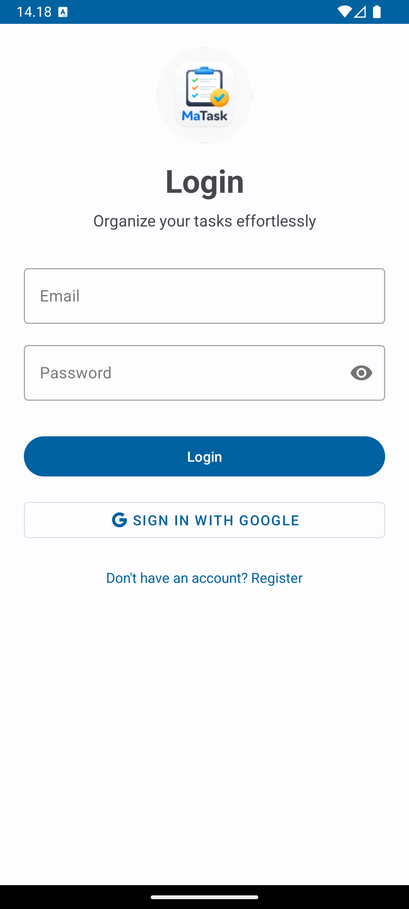
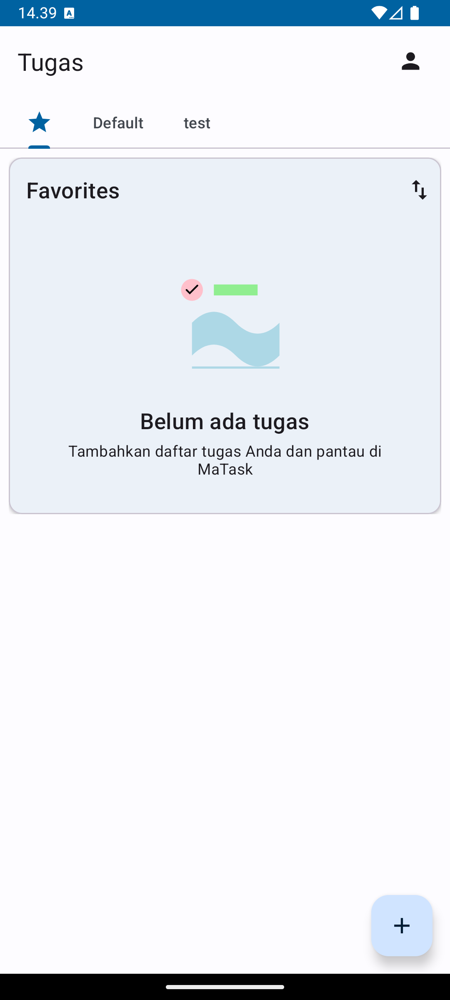
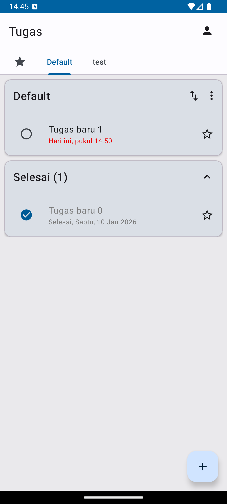
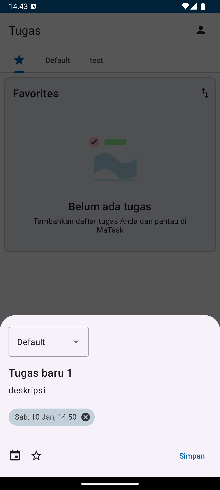
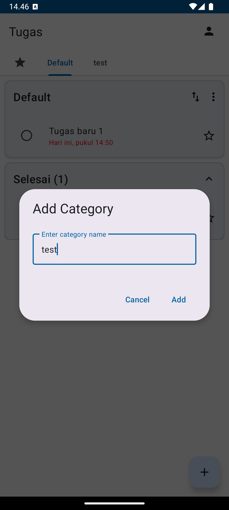
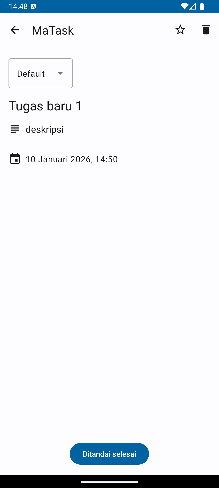
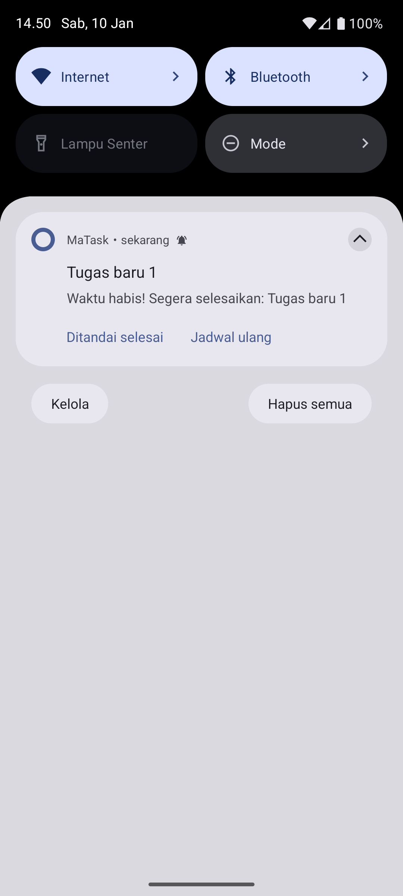
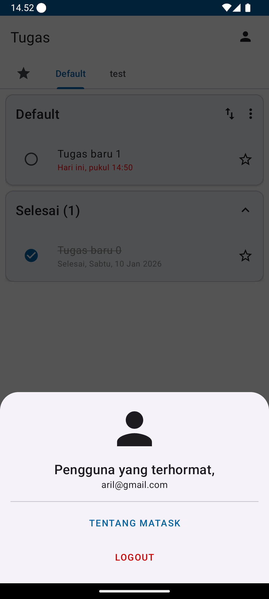
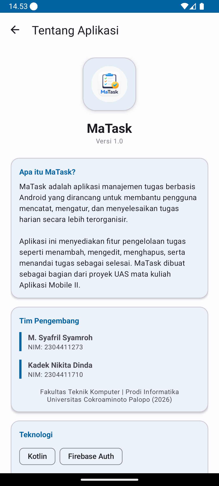

# MaTask - Smart Task Management App

Aplikasi Android berbasis Kotlin yang dirancang untuk membantu pengguna mencatat, mengatur, dan menyelesaikan tugas harian secara lebih terorganisir dengan sinkronisasi cloud real-time.

Proyek ini dikembangkan untuk memenuhi Tugas Besar / Ujian Akhir Semester (UAS) Mata Kuliah Aplikasi Mobile 2.

## 👤 Identitas Pengembang
* **Nama 1:** M. Syafril Syamroh (2304411273)
* **Nama 2:** Kadek Nikita Dinda (2304411710)
* **Prodi:** Informatika - Universitas Cokroaminoto Palopo
* **Tahun:** 2026

## 📱 Deskripsi Aplikasi
* **Nama Aplikasi:** MaTask
* **Aplikasi Rujukan:** Google Tasks / Modern To-Do List
* **MaTask** adalah aplikasi manajemen tugas yang memungkinkan pengguna untuk mengelola daftar pekerjaan mereka dalam berbagai kategori. Aplikasi ini mendukung fitur unggulan seperti **Offline Persistence** (tetap bisa input saat tidak ada internet) dan **Real-time Sync** (data otomatis sama di semua perangkat dengan satu akun). Selain itu, terdapat sistem pengingat cerdas yang akan memberi notifikasi saat tugas mendekati batas waktu (H-1 hingga detik deadline).

## 🛠️ Teknologi & Tools
* **Bahasa:** Kotlin
* **IDE:** Android Studio (Ladybug / Koala)
* **Database:** Firebase Firestore (Real-time Cloud Database)
* **Otentikasi:** Firebase Authentication (Email & Password)
* **Penyimpanan Lokal:** Firestore Offline Persistence
* **Minimum SDK:** Android 7.0 (Nougat)

## ✅ Fitur & Checklist Ujian (CRUD + Fragment)
Aplikasi ini telah memenuhi seluruh kriteria kelulusan UAS:

### 1. Otentikasi User (Firebase Auth)
- [x] Login & Register aman menggunakan Email.
- [x] Auto-login (sesi tersimpan) sehingga user tidak perlu login berulang kali.

### 2. Database & CRUD (Create, Read, Update, Delete)
- [x] **Create (Input):** Menambah tugas baru dengan batas waktu, deskripsi, dan kategori melalui Add Task BottomSheet.
- [x] **Read (Tampil):** Menampilkan daftar tugas berdasarkan kategori, daftar Favorit, dan tab khusus tugas **Lewat Waktu (Overdue)**.
- [x] **Update (Edit):** Mengubah judul, deskripsi, status selesai, atau memindahkan tugas antar kategori.
- [x] **Delete (Hapus):** Menghapus tugas secara permanen dari database dengan dialog konfirmasi.

### 3. Komponen Android
- [x] **Fragment:** Menggunakan Fragment untuk menampilkan daftar tugas pada setiap kategori (ViewPager2 + TabLayout).
- [x] **Intent:** Perpindahan antar halaman (Splash -> Login -> Home -> Detail).
- [x] **RecyclerView:** List tugas yang responsif dengan dukungan fitur *Drag and Drop* untuk mengatur urutan.
- [x] **Notification (AlarmManager):** Notifikasi otomatis berbunyi sejak H-1 deadline hingga waktu habis, lengkap dengan tombol aksi langsung (Ditandai Selesai / Jadwal Ulang).


## 📸 Screenshots
Berikut adalah dokumentasi tampilan aplikasi berdasarkan isi folder `screenshots`:

| Gambar | Deskripsi |
|:-------------------------------:|:--------------------------|
|  | Halaman Login |
|  | Dashboard / Beranda |
|  | Daftar Tugas |
|  | Form Tambah Tugas |
|  | Form Tambah Kategori |
|  | Detail Tugas |
|  | Notifikasi Pengingat Deadline |
|  | Halaman Profil |
|  | Tentang Aplikasi |

*(Catatan: Semua gambar di atas diambil dari folder 'screenshots')*

## 🚀 Cara Menjalankan Aplikasi
1.  **Clone** repository ini ke laptop Anda:
    ```bash
    git clone 
    ```
2.  Buka project di **Android Studio**.
3.  Pastikan file `google-services.json` (Firebase) sudah terhubung.
4.  **Sync Gradle** dan jalankan (**Run**) pada Emulator atau HP Fisik.

---
**Copyright © 2026 [M. Syafril Syamroh]. All Rights Reserved.**